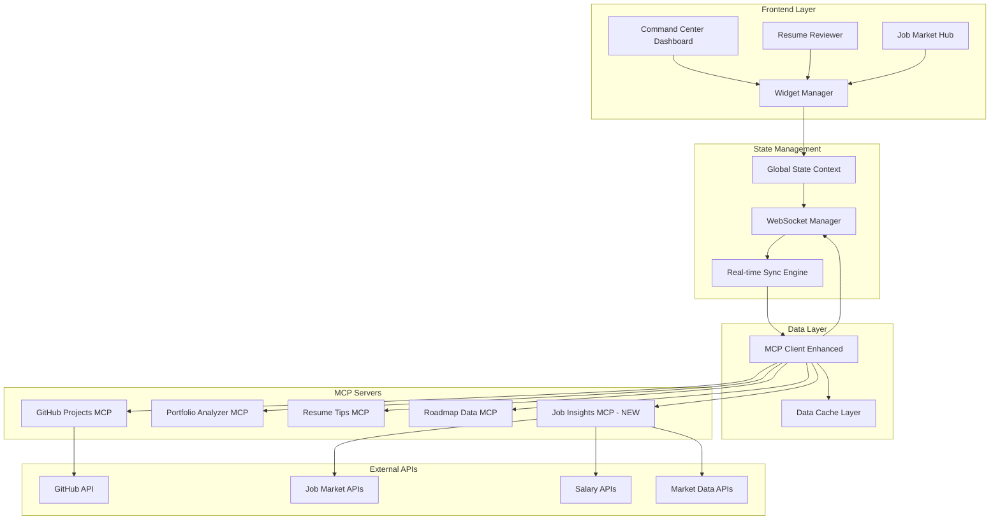

# Command Center Evolution Design

## Overview

The Command Center Evolution transforms SkillBridge from a basic dashboard into a comprehensive career intelligence platform. The design implements a widget-based architecture with real-time data synchronization, advanced visualizations, and interactive user interfaces. The system maintains the existing MCP server architecture while introducing new components for enhanced data visualization, document processing, and market intelligence.

## Architecture

### High-Level Architecture



### Component Architecture

The system follows a modular widget-based architecture where each major feature is implemented as a self-contained widget with its own state management, data fetching, and error handling.

## Components and Interfaces

### Core Dashboard Components

#### 1. CommandCenterDashboard
```typescript
interface CommandCenterDashboard {
  layout: GridLayout;
  widgets: Widget[];
  preferences: UserPreferences;
  realTimeSync: boolean;
}

interface GridLayout {
  columns: number;
  breakpoints: BreakpointConfig;
  widgetPositions: WidgetPosition[];
}

interface Widget {
  id: string;
  type: WidgetType;
  position: GridPosition;
  size: WidgetSize;
  config: WidgetConfig;
  data: any;
  loading: boolean;
  error: Error | null;
}
```

#### 2. GitHubActivityEnhanced
```typescript
interface GitHubActivityWidget extends Widget {
  data: {
    contributionGraph: ContributionData[];
    languageDistribution: LanguageStats[];
    repositoryTimeline: RepositoryActivity[];
    codeQualityMetrics: QualityMetrics;
  };
}

interface ContributionData {
  date: string;
  count: number;
  level: 0 | 1 | 2 | 3 | 4;
  details: CommitDetail[];
}

interface LanguageStats {
  language: string;
  percentage: number;
  bytes: number;
  color: string;
  trending: boolean;
  skillLevel: number;
}

interface QualityMetrics {
  testCoverage: number;
  documentationScore: number;
  codeComplexity: number;
  maintainabilityIndex: number;
}
```

#### 3. SkillRadarChart
```typescript
interface SkillRadarWidget extends Widget {
  data: {
    skillCategories: SkillCategory[];
    radarData: RadarDataPoint[];
    gapAnalysis: SkillGap[];
  };
}

interface RadarDataPoint {
  skill: string;
  current: number;
  target: number;
  importance: 'high' | 'medium' | 'low';
  category: string;
}

interface SkillGap {
  skill: string;
  gap: number;
  priority: 'urgent' | 'moderate' | 'low';
  learningResources: LearningResource[];
  estimatedTime: number;
}
```

#### 4. RoadmapKanbanBoard
```typescript
interface RoadmapWidget extends Widget {
  data: {
    columns: KanbanColumn[];
    milestones: Milestone[];
    progress: ProgressMetrics;
  };
}

interface KanbanColumn {
  id: string;
  title: string;
  milestones: string[];
  limit?: number;
}

interface Milestone {
  id: string;
  title: string;
  description: string;
  status: 'planned' | 'in-progress' | 'review' | 'completed';
  priority: 'high' | 'medium' | 'low';
  estimatedHours: number;
  actualHours?: number;
  skills: string[];
  resources: LearningResource[];
  prerequisites: string[];
  dueDate?: Date;
}
```

### Resume Reviewer Components

#### 5. InteractiveResumeViewer
```typescript
interface ResumeViewerProps {
  document: ResumeDocument;
  comments: AIComment[];
  onCommentClick: (comment: AIComment) => void;
  onDocumentUpdate: (document: ResumeDocument) => void;
}

interface ResumeDocument {
  id: string;
  filename: string;
  content: string;
  pages: DocumentPage[];
  metadata: DocumentMetadata;
}

interface AIComment {
  id: string;
  position: CommentPosition;
  type: 'critical' | 'improvement' | 'suggestion';
  title: string;
  description: string;
  recommendations: string[];
  section: ResumeSection;
  dismissed: boolean;
}

interface CommentPosition {
  page: number;
  x: number;
  y: number;
  width: number;
  height: number;
}
```

#### 6. DocumentViewer
```typescript
interface DocumentViewerProps {
  document: ResumeDocument;
  zoom: number;
  currentPage: number;
  annotations: Annotation[];
  onZoomChange: (zoom: number) => void;
  onPageChange: (page: number) => void;
  onAnnotationClick: (annotation: Annotation) => void;
}

interface Annotation {
  id: string;
  type: 'comment' | 'highlight' | 'suggestion';
  position: AnnotationPosition;
  content: string;
  severity: 'high' | 'medium' | 'low';
}
```

### Job Market Components

#### 7. JobMarketInsightsHub
```typescript
interface JobMarketWidget extends Widget {
  data: {
    marketMap: MarketMapData;
    salaryRanges: SalaryData[];
    trendingSkills: SkillTrend[];
    jobOpportunities: JobOpportunity[];
  };
}

interface MarketMapData {
  regions: MarketRegion[];
  globalStats: GlobalMarketStats;
}

interface MarketRegion {
  id: string;
  name: string;
  coordinates: [number, number];
  jobCount: number;
  averageSalary: number;
  costOfLivingIndex: number;
  topSkills: string[];
  remoteOpportunities: number;
}

interface SalaryData {
  role: string;
  location: string;
  experienceLevel: 'entry' | 'mid' | 'senior' | 'lead';
  salaryRange: {
    min: number;
    max: number;
    median: number;
    currency: string;
  };
  trend: 'up' | 'down' | 'stable';
  dataPoints: number;
}
```

#### 8. InteractiveMarketMap
```typescript
interface MarketMapProps {
  data: MarketMapData;
  filters: MarketFilters;
  selectedRegions: string[];
  onRegionSelect: (regionId: string) => void;
  onFilterChange: (filters: MarketFilters) => void;
}

interface MarketFilters {
  roleTypes: string[];
  experienceLevels: string[];
  salaryRange: [number, number];
  remoteOnly: boolean;
  companySize: string[];
}
```

## Data Models

### Enhanced MCP Response Schemas

#### GitHub Projects MCP Enhanced Response
```typescript
interface GitHubProjectsResponse {
  profile: GitHubProfile;
  repositories: EnhancedRepository[];
  contributionGraph: ContributionGraphData;
  languageStats: LanguageStatistics;
  activityTimeline: ActivityEvent[];
  codeQualityMetrics: QualityMetricsData;
}

interface EnhancedRepository {
  id: string;
  name: string;
  description: string;
  language: string;
  stars: number;
  forks: number;
  lastCommit: Date;
  commits: number;
  contributors: number;
  skillsDetected: DetectedSkill[];
  qualityScore: number;
  complexity: ComplexityMetrics;
  testCoverage?: number;
  documentation: DocumentationMetrics;
}

interface DetectedSkill {
  name: string;
  confidence: number;
  evidence: SkillEvidence[];
  proficiencyEstimate: number;
}
```

#### Portfolio Analyzer MCP Enhanced Response
```typescript
interface PortfolioAnalysisResponse {
  skillAssessment: SkillAssessment;
  projectAnalysis: ProjectAnalysis[];
  careerInsights: CareerInsight[];
  recommendations: PortfolioRecommendation[];
  skillGaps: SkillGapAnalysis[];
  marketAlignment: MarketAlignmentData;
}

interface SkillAssessment {
  skills: AssessedSkill[];
  categories: SkillCategoryData[];
  overallScore: number;
  marketRelevance: number;
}

interface AssessedSkill {
  name: string;
  category: string;
  currentLevel: number;
  marketDemand: number;
  trending: boolean;
  evidence: SkillEvidence[];
  learningPath: LearningPathItem[];
}
```

#### Resume Tips MCP Enhanced Response
```typescript
interface ResumeAnalysisResponse {
  overallScore: number;
  atsCompatibility: number;
  sectionScores: SectionScore[];
  comments: ResumeComment[];
  suggestions: ResumeSuggestion[];
  keywordAnalysis: KeywordAnalysis;
  formatting: FormattingAnalysis;
}

interface ResumeComment {
  id: string;
  section: string;
  position: TextPosition;
  type: 'critical' | 'improvement' | 'suggestion';
  title: string;
  description: string;
  recommendations: string[];
  impact: 'high' | 'medium' | 'low';
}

interface TextPosition {
  page: number;
  paragraph: number;
  sentence: number;
  startChar: number;
  endChar: number;
  boundingBox: BoundingBox;
}
```

#### Job Insights MCP (New Server) Response
```typescript
interface JobInsightsResponse {
  marketData: JobMarketData;
  salaryInsights: SalaryInsights;
  skillTrends: SkillTrendData[];
  jobOpportunities: JobOpportunityData[];
  locationInsights: LocationInsightData[];
}

interface JobMarketData {
  totalJobs: number;
  growthRate: number;
  competitionLevel: number;
  averageTimeToHire: number;
  topCompanies: CompanyData[];
  emergingRoles: EmergingRole[];
}

interface SalaryInsights {
  ranges: SalaryRangeData[];
  trends: SalaryTrendData[];
  factors: SalaryFactorData[];
  negotiations: NegotiationInsight[];
}
```

## Error Handling

### Widget-Level Error Handling
```typescript
interface WidgetErrorBoundary {
  fallbackComponent: React.ComponentType<ErrorFallbackProps>;
  onError: (error: Error, errorInfo: ErrorInfo) => void;
  resetOnPropsChange: boolean;
}

interface ErrorFallbackProps {
  error: Error;
  resetError: () => void;
  widgetType: string;
}

// Error Recovery Strategies
enum ErrorRecoveryStrategy {
  RETRY_WITH_BACKOFF = 'retry_with_backoff',
  FALLBACK_TO_CACHE = 'fallback_to_cache',
  SHOW_PARTIAL_DATA = 'show_partial_data',
  GRACEFUL_DEGRADATION = 'graceful_degradation'
}
```

### MCP Server Error Handling
```typescript
interface MCPErrorHandler {
  handleServerError(serverId: string, error: MCPError): Promise<ErrorResponse>;
  handleNetworkError(error: NetworkError): Promise<ErrorResponse>;
  handleTimeoutError(error: TimeoutError): Promise<ErrorResponse>;
  handleRateLimitError(error: RateLimitError): Promise<ErrorResponse>;
}

interface ErrorResponse {
  strategy: ErrorRecoveryStrategy;
  fallbackData?: any;
  retryAfter?: number;
  userMessage: string;
  technicalDetails?: string;
}
```

## Testing Strategy

### Component Testing
```typescript
// Widget Testing Framework
interface WidgetTestSuite {
  renderTests: WidgetRenderTest[];
  interactionTests: WidgetInteractionTest[];
  dataTests: WidgetDataTest[];
  errorTests: WidgetErrorTest[];
}

interface WidgetRenderTest {
  name: string;
  props: any;
  expectedElements: string[];
  accessibility: AccessibilityTest[];
}

interface WidgetInteractionTest {
  name: string;
  userActions: UserAction[];
  expectedBehavior: ExpectedBehavior[];
}
```

### Integration Testing
```typescript
// MCP Integration Testing
interface MCPIntegrationTest {
  serverName: string;
  testCases: MCPTestCase[];
  mockResponses: MockResponse[];
  errorScenarios: ErrorScenario[];
}

interface MCPTestCase {
  name: string;
  request: MCPRequest;
  expectedResponse: MCPResponse;
  timeout: number;
  retryPolicy: RetryPolicy;
}
```

### Performance Testing
```typescript
interface PerformanceMetrics {
  widgetLoadTime: number;
  dataFetchTime: number;
  renderTime: number;
  memoryUsage: number;
  bundleSize: number;
}

interface PerformanceBenchmarks {
  widgetLoadTime: { target: 500, max: 1000 }; // milliseconds
  dataFetchTime: { target: 200, max: 500 };
  renderTime: { target: 100, max: 200 };
  memoryUsage: { target: 50, max: 100 }; // MB
}
```

## State Management Strategy

### Global State Architecture
```typescript
// Context-based State Management
interface GlobalAppState {
  user: UserState;
  dashboard: DashboardState;
  widgets: WidgetState[];
  realTimeSync: SyncState;
  preferences: UserPreferences;
}

interface DashboardState {
  layout: GridLayout;
  activeWidgets: string[];
  widgetData: Record<string, any>;
  loading: Record<string, boolean>;
  errors: Record<string, Error | null>;
}

interface WidgetState {
  id: string;
  type: WidgetType;
  data: any;
  loading: boolean;
  error: Error | null;
  lastUpdated: Date;
  config: WidgetConfig;
}
```

### Real-time Synchronization
```typescript
interface RealTimeSyncEngine {
  subscriptions: SyncSubscription[];
  connectionStatus: ConnectionStatus;
  syncQueue: SyncOperation[];
  conflictResolution: ConflictResolver;
}

interface SyncSubscription {
  widgetId: string;
  dataSource: string;
  updateInterval: number;
  lastSync: Date;
  syncStrategy: SyncStrategy;
}

enum SyncStrategy {
  REAL_TIME = 'real_time',
  PERIODIC = 'periodic',
  ON_DEMAND = 'on_demand',
  HYBRID = 'hybrid'
}
```

### Widget State Management
```typescript
// Individual Widget State
interface WidgetStateManager {
  state: WidgetState;
  actions: WidgetActions;
  selectors: WidgetSelectors;
  middleware: WidgetMiddleware[];
}

interface WidgetActions {
  loadData: () => Promise<void>;
  updateData: (data: any) => void;
  handleError: (error: Error) => void;
  resetState: () => void;
  updateConfig: (config: Partial<WidgetConfig>) => void;
}
```

## API Contract Definitions

### MCP Server Request/Response Contracts

#### GitHub Projects MCP Enhanced
```typescript
// Request
interface GitHubProjectsRequest {
  method: 'github_projects_enhanced';
  params: {
    username: string;
    includeContributions: boolean;
    includeQualityMetrics: boolean;
    timeRange: 'week' | 'month' | 'year' | 'all';
    repositoryLimit?: number;
  };
}

// Response
interface GitHubProjectsResponse {
  success: boolean;
  data: {
    profile: GitHubProfile;
    repositories: EnhancedRepository[];
    contributionGraph: ContributionData[];
    languageStats: LanguageStats[];
    qualityMetrics: QualityMetrics;
    activityTimeline: ActivityEvent[];
  };
  metadata: {
    fetchedAt: string;
    rateLimitRemaining: number;
    cacheExpiry: string;
  };
}
```

#### Portfolio Analyzer MCP Enhanced
```typescript
// Request
interface PortfolioAnalysisRequest {
  method: 'analyze_portfolio_enhanced';
  params: {
    githubData: GitHubProjectsResponse;
    targetRole: string;
    includeSkillGaps: boolean;
    includeMarketAlignment: boolean;
  };
}

// Response
interface PortfolioAnalysisResponse {
  success: boolean;
  data: {
    skillAssessment: SkillAssessment;
    projectAnalysis: ProjectAnalysis[];
    skillGaps: SkillGap[];
    marketAlignment: MarketAlignment;
    recommendations: Recommendation[];
  };
  confidence: number;
  analysisVersion: string;
}
```

#### Resume Tips MCP Enhanced
```typescript
// Request
interface ResumeAnalysisRequest {
  method: 'analyze_resume_enhanced';
  params: {
    resumeContent: string;
    resumeFormat: 'pdf' | 'docx' | 'txt';
    targetRole?: string;
    includeATSAnalysis: boolean;
    includePositionalComments: boolean;
  };
}

// Response
interface ResumeAnalysisResponse {
  success: boolean;
  data: {
    overallScore: number;
    atsCompatibility: number;
    sectionScores: SectionScore[];
    comments: PositionalComment[];
    suggestions: ImprovementSuggestion[];
    keywordAnalysis: KeywordAnalysis;
  };
  processingTime: number;
  documentMetadata: DocumentMetadata;
}
```

#### Job Insights MCP (New Server)
```typescript
// Request
interface JobInsightsRequest {
  method: 'get_market_insights';
  params: {
    role?: string;
    location?: string;
    experienceLevel?: string;
    skills?: string[];
    includeMap: boolean;
    includeSalaryData: boolean;
    includeTrends: boolean;
  };
}

// Response
interface JobInsightsResponse {
  success: boolean;
  data: {
    marketMap: MarketMapData;
    salaryInsights: SalaryData[];
    skillTrends: SkillTrend[];
    jobOpportunities: JobOpportunity[];
    marketAnalysis: MarketAnalysis;
  };
  dataFreshness: {
    lastUpdated: string;
    sources: string[];
    confidence: number;
  };
}
```

### Frontend API Contracts

#### Widget Data Fetching
```typescript
interface WidgetDataAPI {
  fetchWidgetData<T>(widgetId: string, params?: any): Promise<APIResponse<T>>;
  subscribeToUpdates(widgetId: string, callback: (data: any) => void): () => void;
  updateWidgetConfig(widgetId: string, config: WidgetConfig): Promise<void>;
  refreshWidget(widgetId: string): Promise<void>;
}

interface APIResponse<T> {
  success: boolean;
  data: T;
  error?: APIError;
  metadata: ResponseMetadata;
}

interface ResponseMetadata {
  timestamp: string;
  source: string;
  cacheHit: boolean;
  processingTime: number;
}
```

#### Real-time Updates API
```typescript
interface RealTimeAPI {
  connect(): Promise<WebSocket>;
  subscribe(channel: string, callback: (data: any) => void): void;
  unsubscribe(channel: string): void;
  send(message: RealTimeMessage): void;
  getConnectionStatus(): ConnectionStatus;
}

interface RealTimeMessage {
  type: 'subscribe' | 'unsubscribe' | 'update' | 'ping';
  channel?: string;
  data?: any;
  timestamp: string;
}
```

This design provides a comprehensive technical foundation for implementing the Command Center Evolution while maintaining compatibility with the existing SkillBridge architecture and MCP server ecosystem.